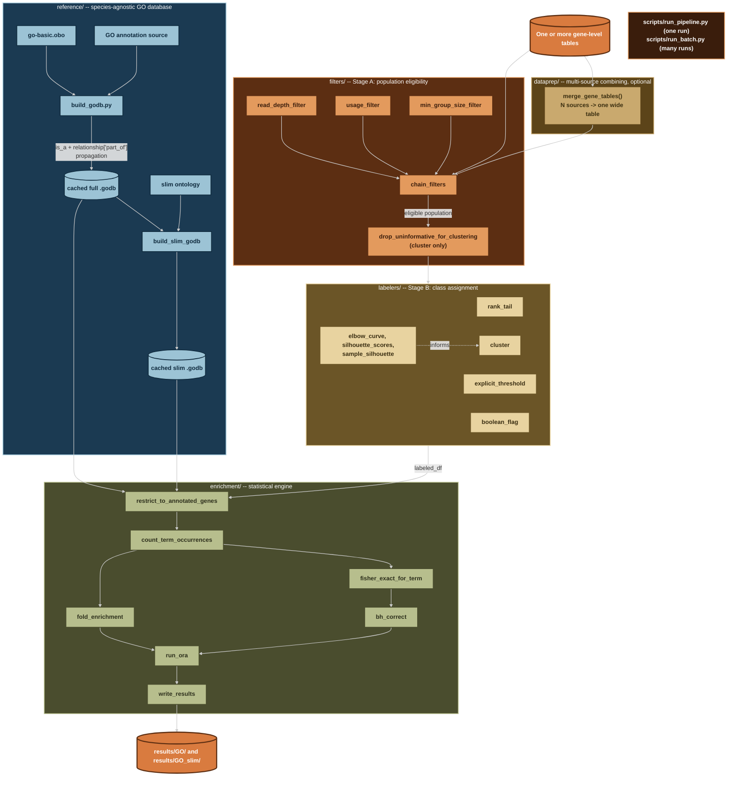

# go-gsea

A generic, species-agnostic GO over-representation analysis (ORA) pipeline.

This tool is not built for one species, one condition, or one research question.
It exposes three independent, composable stages: determine an eligible
population, assign a class label, run the enrichment test. The same tested
engine can serve any labeling question, on any organism with a GO-annotated
reference, without touching the core code. Chlamydomonas is used throughout
this repo as a worked example only (see section 8), the tool itself is meant
to generalize to a different condition on the same species, a different
species entirely, or a different kind of labeling question altogether.

Data and results are deliberately kept out of this repository entirely, see
section 3.

---

## Quick start

Install the environment:

```bash
conda env create -f environment.yml
conda activate go-gsea
```

Run the test suite, to confirm everything imports and works on your machine:

```bash
pytest tests/ -v
```

Minimal single-file example run. This assumes a `.godb` already built from
`reference/build_godb.py` (see section 5) and a gene-level input table
matching section 2's required shape:

```bash
python scripts/run_pipeline.py \
    --input-table path/to/your_gene_table.tsv.gz \
    --godb path/to/your.godb.pkl \
    --metric-col your_metric_column \
    --label-strategy rank_tail --pct 10 \
    --output-dir results/GO \
    --dataset-name your_run_name
```

Multi-source example, for combining several files (e.g. multiple
conditions of the same species) into one wide table before clustering
(see `dataprep/merge_tables.py` and section 6):

```bash
python scripts/run_pipeline.py \
    --merge-manifest merge_manifest.txt \
    --godb path/to/your.godb.pkl \
    --metric-col cond_a cond_b \
    --label-strategy cluster --n-clusters 2 \
    --output-dir results/GO \
    --dataset-name your_merged_run_name
```

Either form writes `summary.<name>.all.tsv` (every GO term tested) and, for
each class with any significant term, `summary.<name>.<class>.over.tsv`
and `.under.tsv` into `results/GO/`. See section 6 for the full flag
reference, and section 8 for seven complete, real, worked demos on real
data.

---

## 1. Why this exists, and its relationship to prior work

This project's statistical core is verified against a real, working precedent:
S. Yamasaki's `create_go_annotation_db.py` / `stats_test_based_on_go.py`
(`sy-scripts`), used in prior lab GO-enrichment work. The Fisher's exact test
construction, the `log2((observed+1)/(expected+1))` fold-enrichment formula,
the Benjamini-Hochberg correction, and the population-definition philosophy
(background = the genes actually analyzable for a given question, never "all
genes in the genome") were all confirmed against that precedent's source code
and real output files before being reimplemented here.

What's different, deliberately:

- **Not tied to one container.** The original tools only run inside a specific
  Singularity image. This pipeline runs in a plain conda environment.
- **Class-label generation is a reusable, tested layer**, not one-off notebook
  code rewritten by hand for every new research question.
- **Every numeric piece has a test**, written against small, hand-checkable
  synthetic data before ever touching real biology. This caught several real
  bugs during development that would otherwise have silently corrupted
  results (see section 7).
- **The GO annotation source is a per-application decision, not a hardcoded
  default**, see section 4 and the worked example in section 8.
- **One CLI runs both full-GO and GO-slim in a single call**, writing to
  separate output directories.
- **A generic multi-source merge primitive** (`dataprep/merge_tables.py`)
  combines any number of named columns from any number of files into one
  wide table before labeling, unblocking real multi-condition or
  multi-technology clustering without any species- or condition-specific
  code.
- **A plain-text batch driver** (`scripts/run_batch.py`) runs many
  species/condition/metric combinations from one manifest file.
- **Stage A population-eligibility filters (`filters/population.py`) are
  wired into the real CLI**, not just built and tested in isolation. An
  earlier version of this pipeline had these filters fully implemented and
  verified once by hand on real data, but genuinely unreachable from
  `scripts/run_pipeline.py` -- every real demo silently skipped Stage A
  entirely. This has been fixed, and the fix is covered by a regression
  test confirming every prior demo's behavior is unchanged when the new
  flags are not used.
- **A formalized, correctly-scoped fix for a real clustering artifact**:
  genes tied at a shared floor value (e.g. all zero) can mechanically
  collapse into a spuriously "perfect" cluster under Ward's-method
  distance clustering. `filters.population.drop_uninformative_for_clustering()`
  and `--drop-uninformative` address this, explicitly scoped to `cluster`
  only (not `rank_tail`/`explicit_threshold`/`boolean_flag`, which already
  handle these genes correctly), with the documented expectation that
  excluded genes get a companion `boolean_flag`/`explicit_threshold` GO run
  of their own rather than being silently dropped from the analysis
  altogether, see section 4.
- **Verified on two distinct real metrics, two distinct labeling
  mechanisms, and both single-file and merged-multi-condition scopes**,
  all on the same real dataset. Seven real demos (section 8), all
  independently converging on the same core biological signal.

---

## 2. Expected input data

`go-gsea` does not read raw sequencing data, alignments, or annotation
output directly. It expects one or more already-prepared, gene-level (or
transcript-level, or any other feature-level) tables as its starting point.
Everything upstream of that table, producing it from raw reads, is a
separate concern.

### Minimal requirement, independent of any specific upstream pipeline

If you are not using the `Longread_pipeline`/Project1 workflow the worked
example is built on, here is the actual, complete requirement, confirmed
directly from the code (`scripts/run_pipeline.py`'s `load_input_table()`
and `load_merged_table()` never touch anything beyond what's listed here):

- A tab-separated file (plain or `.gz`), one row per gene.
- **Exactly one required column: a gene ID column** (default name
  `gene_id`, override with `--id-col` if yours is named differently).
- **One or more numeric or categorical columns to label genes by**
  (`--metric-col`), whatever they are named, whatever they mean. Nothing
  in this tool assumes anything about their scale, distribution, or
  biological meaning beyond what the chosen labeling strategy requires
  (see `--label-strategy` in section 6).

That's the entire hard requirement. Everything else in this document
(read-depth columns, usage-fraction columns, spike-in IDs, version
suffixes) is specific to how the Chlamydomonas worked example's data
happens to be shaped, not a requirement of the tool itself. If your table
only has a gene ID column and one metric column, this pipeline runs on it
exactly as-is.

### Optional additional structure this tool can use, if present

- **ID normalization**: `--strip-id-suffix` (regex) and `--exclude-id`
  (repeatable) if your gene IDs need cleanup before matching against a
  GO annotation source, or if certain rows (e.g. a spike-in control)
  should never be labeled.
- **Population-eligibility filters** (`filters/population.py`, wired into
  the CLI as `--read-depth-col`/`--usage-col`/`--min-group-col` and their
  matching thresholds): entirely optional, off by default, for datasets
  that carry read-depth or usage-fraction columns worth filtering on
  before any class label is assigned. See section 4's first design
  principle for why this matters, and section 6 for the exact flags.
- **Combining multiple files** (e.g. several conditions, several
  technologies, of the same species): `dataprep/merge_tables.py`'s
  `merge_gene_tables()` inner-joins named columns from any number of
  files on gene ID, keeping only genes present in every source. See
  section 6's `--merge-manifest` documentation.

**Where the worked example's data comes from:** gene-level tables produced
by a Nanopore full-length cDNA long-read RNA-seq processing pipeline
(`Longread_pipeline`, a separate, species-agnostic wet-processing pipeline
that turns raw FASTQ into an annotated per-gene/per-transcript table).
`go-gsea` has no dependency on that pipeline and does not assume long-read
data specifically, any tool producing a table matching the minimal
requirement above is a valid input source, including short-read RNA-seq,
microarray, or a spreadsheet you built by hand. **If you need the upstream
long-read processing pipeline itself, contact Ibnu Halim directly, it is a
separate, not-yet-public repository.**

---

## 3. Repository and data structure

### What each folder is for

| Folder | Purpose |
|---|---|
| `reference/` | Species-agnostic GO database construction: parses a GO annotation source + `go-basic.obo`, propagates `is_a`/`part_of` relationships, builds the full-GO and GO-slim `.godb` cache files. |
| `filters/` | Stage A: population-eligibility filters, applied before any class label is assigned (`read_depth_filter`, `usage_filter`, `min_group_size_filter`, `drop_uninformative_for_clustering`, and `chain_filters` to compose them). |
| `labelers/` | Stage B: class-assignment strategies (`rank_tail`, `explicit_threshold`, `boolean_flag`, `cluster`), plus k-selection diagnostics (`elbow_curve`, `silhouette_scores`, `sample_silhouette`) for `cluster`. |
| `dataprep/` | Generic multi-source table merging (`merge_gene_tables()`), for combining several input files into one wide table before labeling. |
| `enrichment/` | The statistical engine: Fisher's exact test, fold-enrichment, Benjamini-Hochberg correction, the `run_ora()` orchestrator, and `write_results()` for output-file writing. |
| `scripts/` | CLI entry points: `run_pipeline.py` (one run, single-file or merged) and `run_batch.py` (many runs from one manifest). |
| `notebooks/` | Exploration only. `select_cluster_k.ipynb` (pre-labeling k-selection diagnostics, single-file or merged) and `eda_results.ipynb` (post-enrichment results exploration). Never writes to `results/`. |
| `tests/` | One test file per module, synthetic data only, run via `pytest`. |
| `docs/examples/` | Worked examples showing the tool applied to real data, e.g. `chlamydomonas.md`. |
| `data/`, `results/` | Symlinks to a confidential location outside git entirely, see below. **You need to set these up yourself on a fresh clone**, they do not exist by default. |

### Setting up on a fresh clone

`data` and `results` are symlinks, and cloning this repository does **not**
create them, since nothing they point to is committed to git (deliberately,
see below). On a fresh clone, create them yourself, pointing at wherever
you keep your own confidential data and results:

```bash
cd go-gsea
mkdir -p /path/to/your/confidential/storage/data/go_reference
mkdir -p /path/to/your/confidential/storage/data/raw
mkdir -p /path/to/your/confidential/storage/results/GO
mkdir -p /path/to/your/confidential/storage/results/GO_slim

ln -s /path/to/your/confidential/storage/data data
ln -s /path/to/your/confidential/storage/results results
```

Without this step, every command in this README and the worked example
will fail with a "file not found" error at `data/...` or `results/...`,
not because anything is broken, but because those paths genuinely don't
exist until you create them.

### Code repository layout

```
go-gsea/
├── README.md
├── LICENSE
├── environment.yml
├── pytest.ini
├── reference/
├── filters/
├── labelers/
├── dataprep/
├── enrichment/
├── scripts/
├── notebooks/
├── tests/
├── docs/
│   └── examples/
├── data      -> (symlink, see above)
└── results   -> (symlink, see above)
```

### Confidential data/results location, organized per species

```
<your confidential storage>/
├── data/
│   ├── raw/
│   │   ├── <SPECIES>_<CONDITION>.gene_data.tsv.gz
│   │   └── ...
│   └── go_reference/
│       ├── go-basic.obo                shared, species-agnostic
│       ├── goslim_generic.obo           shared, species-agnostic
│       ├── <SPECIES_1>/
│       │   ├── <SPECIES_1>.annotation_info.txt.gz  (or GAF, whichever
│       │   │                            source was verified right, see
│       │   │                            section 4)
│       │   ├── <SPECIES_1>.godb.pkl
│       │   └── <SPECIES_1>.slim.godb.pkl
│       └── <SPECIES_2>/  ...
└── results/
    ├── GO/
    │   ├── summary.<SPECIES>_<CONDITION>.<metric>.all.tsv
    │   └── summary.<SPECIES>_<COND_A>-<COND_B>.<metric>_cluster.all.tsv
    │        (merged multi-condition run naming)
    └── GO_slim/
```

`.gitignore` excludes both symlink targets by name, with no trailing slash.
A symlink pointing at a directory is not itself a directory as far as git's
slash-suffixed ignore patterns are concerned, this was a real early mistake
in this project, worth remembering.

---

## 4. Design principles

- **Population = every gene actually analyzable for that specific question,
  never "all genes in the genome" or a population borrowed from a different
  analysis.** Enforced mechanically at three separate points:
  `filters/population.py`'s read-depth/usage/min-group filters (now
  reachable from the real CLI, not just built and tested in isolation);
  `dataprep.merge_tables.merge_gene_tables()`'s default inner join
  (a gene not present in every merged source is not part of the population
  at all); and `enrichment.ora.restrict_to_annotated_genes()` (a gene with
  zero GO annotation cannot contribute to any term's count and is dropped
  before counting begins).
- **A clustering-tool-mismatch problem is not the same as a claim that
  genes are biologically uninformative.** Genes tied at a shared floor
  value (e.g. all zero) mechanically collapse to identical points under
  Ward's-method distance clustering, producing a spuriously "perfect"
  cluster that reflects the tie, not real structure -- a real,
  repeatedly-confirmed artifact (see section 8). The fix
  (`drop_uninformative_for_clustering()`, `--drop-uninformative`) is
  scoped deliberately: use it only before `cluster`, never before
  `rank_tail`/`explicit_threshold`/`boolean_flag` (which already handle
  these genes correctly, with no artifact), and pair its use with a
  companion `boolean_flag`/`explicit_threshold` GO run on the same
  population, so the excluded genes' real biology is still tested, just
  with a tool that fits their distribution.
- **Both `is_a` and `part_of` relationships must be propagated for correct
  GO term inheritance.** `goatools`'s own `GODag.get_all_parents()` was
  empirically confirmed to only follow `is_a`. `reference/build_godb.py`
  implements its own `get_all_ancestors()` walker combining both.
- **GO-slim is a filter on top of full-GO propagation, not a separate
  propagation pass.** Verified with a direct subset check on real data,
  zero violations, and confirmed consistent across every real run in
  section 8.
- **Significance threshold: p < 0.01, uncorrected, is the default, not
  BH-corrected q-value.** The precedent lab's own documented reasoning:
  repeated testing across classes compounds the multiple-testing problem
  beyond what standard FDR correction assumes; GO terms have parent-child
  dependencies that violate FDR's independence assumption; q-values are
  unstable across reruns for reasons unrelated to the actual data, while
  p-values are not. Confirmed concretely: in every real run so far, the
  smallest observed p-values still carry q=1.0 with over a thousand terms
  tested per class. Results at this threshold should be described as genes
  that "tended to include" a GO term, not as "statistically significant"
  findings.
- **A GO-slim run producing zero (or very few) significant terms is not
  automatically a sign of correctness or of a bug**, check the actual
  p-value spread in the "all" output file. Confirmed with multiple
  contrasting real runs, same code, different data-dependent outcomes
  each time.
- **`fold_enrichment` direction is computed independently of `scipy`'s
  Fisher's exact `odds_ratio`**, since `odds_ratio`'s sign/magnitude
  depend on 2x2 table row orientation, an ambiguity that caused real test
  failures during development.
- **The GO annotation source must be chosen for correct gene-ID alignment
  with the specific reference genome in use, never assumed generically.**
  See the worked example (section 8) for a real case where the obvious
  choice would have caused a large, silent ID mismatch.
- **An unknown-gene-ratio guard should exist, but its threshold is a
  tunable parameter, not a fixed constant** (`run_ora(...,
  unknown_ratio_thresh=...)`).
- **A derived metric is not an independent second question**, even when it
  produces a genuinely different GO enrichment result.
- **Different labeling mechanisms converging on the same biological
  signal is stronger evidence than either mechanism's result alone.**
  Confirmed repeatedly across the worked example's seven real demos.
- **Real clustering runs should be checked for tied-value artifacts
  before a chosen k is trusted.** A cluster with a suspiciously perfect
  mean/min silhouette is worth checking directly, not assumed to reflect
  real structure. `notebooks/select_cluster_k.ipynb` now surfaces this
  check automatically.
- **Ward's-method clustering has been verified deterministic within a
  session**, but a previously-documented result should not be assumed to
  reproduce exactly without re-verifying in the current environment, see
  the worked example (section 8) for a real case where an earlier result
  could not be reproduced and was corrected rather than carried forward.

---

## 5. Architecture



Every arrow above is real, reachable from the CLI, not aspirational.
`filters/` genuinely feeds into `labelers/` now, this was not true in an
earlier version of this pipeline (see section 1).

---

## 6. CLI reference

### `scripts/run_pipeline.py`

**Input source (exactly one required):**

| Flag | Meaning |
|---|---|
| `--input-table` | Path to a single gene-level TSV, plain or `.gz` |
| `--merge-manifest` | Path to a plain-text, INI-style manifest listing multiple source files to merge into one wide table first. Mutually exclusive with `--input-table` |

Merge manifest format, one `[section]` per source, section name becomes
the merged table's column name:

```ini
[cond_a]
path = data/raw/species_condA.gene_data.tsv.gz
value_col = PR_gene

[cond_b]
path = data/raw/species_condB.gene_data.tsv.gz
value_col = PR_gene
```

Required keys per section: `path`, `value_col`.

**Reference and ID handling:**

| Flag | Required | Meaning |
|---|---|---|
| `--godb` | yes | Path to a cached full `.godb` |
| `--slim-godb` | no | Path to a cached slim `.godb`. If given, also runs GO-slim enrichment |
| `--id-col` | no, default `gene_id` | Gene ID column name |
| `--strip-id-suffix` | no | Regex stripped from gene IDs before matching against the godb. Applied BEFORE `--exclude-id` |
| `--exclude-id` | no, repeatable | Gene ID(s) to drop before labeling |

**Stage A population-eligibility filters** (all optional, off by default,
applied in this fixed order):

| Flag | Meaning |
|---|---|
| `--read-depth-col`, `--read-depth-thresh` | `filters.population.read_depth_filter`. Keeps rows >= thresh |
| `--usage-col`, `--usage-thresh` | `filters.population.usage_filter`. Keeps rows >= thresh |
| `--min-group-col`, `--min-group-n` | `filters.population.min_group_size_filter`. Keeps groups with >= n rows |
| `--drop-uninformative`, `--drop-uninformative-thresh` (default 0) | `filters.population.drop_uninformative_for_clustering`. **Only use with `--label-strategy cluster`**, see section 4. Pair with a companion `boolean_flag`/`explicit_threshold` run on the excluded genes |

**Labeling (Stage B):**

| Flag | Meaning |
|---|---|
| `--metric-col` | Required, one or more values. `rank_tail`/`explicit_threshold`/`boolean_flag` require exactly one. `cluster` accepts one or more |
| `--label-strategy` | Required. One of `rank_tail`, `explicit_threshold`, `boolean_flag`, `cluster` |
| `--pct` | Used by `rank_tail`. Percent for each tail, default 10 |
| `--high-thresh`, `--low-thresh` | Used by `explicit_threshold` |
| `--n-clusters` | Used by `cluster`. Choose using `notebooks/select_cluster_k.ipynb`, not by guessing |

**Enrichment and output:**

| Flag | Meaning |
|---|---|
| `--output-dir` | Required |
| `--slim-output-dir` | Required if `--slim-godb` is given |
| `--dataset-name` | Required |
| `--unknown-ratio-thresh` | Default 0.9 |
| `--thresh-type` | `p` or `q`, default `p` |
| `--thresh` | Default 0.01 |

### `scripts/run_batch.py`

Plain-text, INI-style manifest, one `[section]` per run:

```ini
[CR_3D_PR_gene]
species = CR
condition = 3D
input_table = data/raw/CR_3D.gene_data.tsv.gz
godb = data/go_reference/CR/CR.godb.pkl
metric_col = PR_gene
label_strategy = rank_tail
pct = 10
```

Required keys: `species`, `condition`, `input_table`, `godb`, `metric_col`,
`label_strategy`. `dataset_name`, if omitted, is auto-derived as
`<species>_<condition>.<metric_col>`. One section failing does not stop
the rest of the batch.

```bash
python scripts/run_batch.py manifest.txt
python scripts/run_batch.py manifest.txt --dry-run
```

### `notebooks/select_cluster_k.ipynb`

k-selection diagnostics before a real `cluster` run: raw distribution,
elbow curve, silhouette score across k, per-sample silhouette at a
candidate k (with an automatic warning if a cluster's mean/min silhouette
looks like the tied-value artifact described in section 4), a dendrogram
colored to match the chosen k, and a clustermap (heatmap + row dendrogram,
column dendrogram only when 3+ columns are being clustered). Supports both
single-file (`INPUT_TABLE`) and merged (`MERGE_MANIFEST`, same format as
`--merge-manifest` above) input, set exactly one in the config cell.

Seven complete, real invocations covering both single-file and merged
scopes are shown in `docs/examples/chlamydomonas.md` (section 8).

---

## 7. Testing status

**103 automated tests, all passing.**

| Module | Tests | Notes |
|---|---|---|
| `filters/population.py` | 12 | 7 for the original three filters, 5 for `drop_uninformative_for_clustering`. Also verified against real data (section 8) |
| `labelers/labelers.py` | 12 | 8 for the four labeling strategies, 4 for k-selection diagnostics |
| `enrichment/ora.py` | 23 | Includes the `restrict_to_annotated_genes` population-correctness fix |
| `enrichment/output.py` | 5 | Covers the all/over/under file split |
| `dataprep/merge_tables.py` | 9 | Inner-join default, explicit outer-join option, gzip support, guardrails |
| `scripts/run_pipeline.py` (core) | 6 | Real subprocess-based CLI tests |
| `scripts/run_pipeline.py` (`--metric-col` widening) | 9 | Single- vs multi-column strategy validation |
| `scripts/run_pipeline.py` (`--merge-manifest`) | 5 | Mutual exclusivity, inner-join through the full CLI path |
| `scripts/run_pipeline.py` (Stage A filters) | 7 | Regression guard confirming unchanged behavior when unused, plus real filter composition through the CLI |
| `scripts/run_pipeline.py` (`--drop-uninformative`) | 4 | Single- and multi-column cases, custom threshold |
| `scripts/run_batch.py` | 11 | Plain-text manifest parsing plus real multi-section batch execution |
| `reference/build_godb.py` | Not unit-tested; verified against real data instead (section 8) | The `is_a`/`part_of` propagation gap and the slim intersection's subset property were both caught via direct interactive verification |

---

## 8. Worked examples

- **[`docs/examples/chlamydomonas.md`](docs/examples/chlamydomonas.md)**,
  *Chlamydomonas reinhardtii*. Seven real demos across two growth-stage
  conditions, three metrics, two labeling strategies, and both single-file
  and genuine merged-multi-condition scopes. Every demo independently
  converges on the same core biological signal (ribosome/translation-
  machinery genes), the strongest form of evidence this project has
  produced that the pipeline is finding something real.

---

## 9. Known limitations and open items

- **Ortholog-transfer GO supplementation is designed, not built.**
- **`gseapy` is an unused dependency.** Installed for a future ranked/GSEA
  mode, no code path uses it yet.
- **No provenance-stamping on output files.** `write_results()` writes
  plain TSVs without a metadata footer.
- **`scripts/check_id_overlap.py` (ID-verification for a new species'
  candidate GO annotation source) is not built.** The check has been done
  correctly by hand for Chlamydomonas, not yet a reusable script.
- **The `drop_uninformative_for_clustering()` companion-run guidance is
  documentation only.** No real demo has yet actually run the recommended
  companion `boolean_flag` pass on the genes it would exclude, this is a
  stated best practice, not a demonstrated one.
- **All seven real demos are gene-level, one species, two conditions.**
  `explicit_threshold` and `boolean_flag` remain unverified outside
  synthetic tests. Transcript- or variant-level data, and a second
  species, are also unexercised.
- **Commit history is intentionally terse.** This README (and the worked
  examples it links to), not the commit log, is the authoritative record
  of what changed and why.