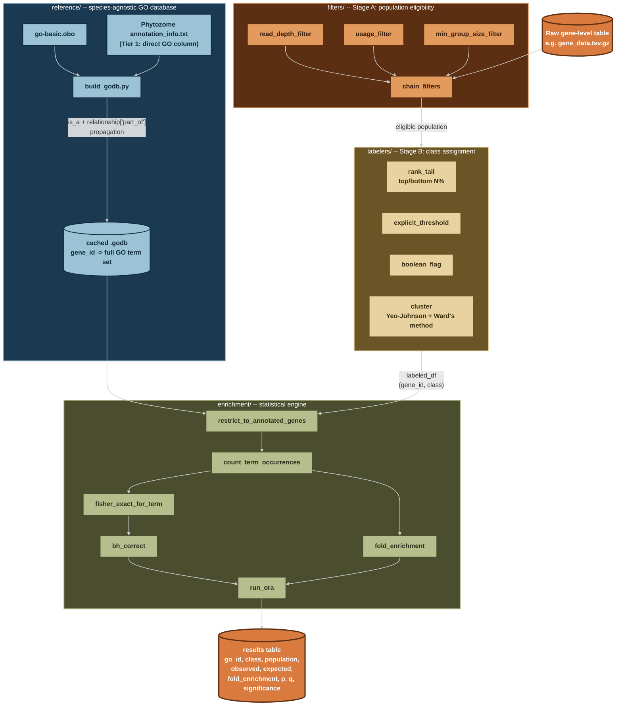

# go-gsea

A generic, species-agnostic GO over-representation analysis (ORA) pipeline.

This tool is not built for one species or one research question. It exposes three
independent, composable stages — determine an eligible population, assign a class
label, run the enrichment test — so the same tested engine can serve a PR-based
question in *Chlamydomonas reinhardtii* today and a completely different question,
on a completely different organism, later, without touching the core code.

Data and results are deliberately kept out of this repository entirely — see
"Data and results location" below.

---

## 1. Why this exists, and its relationship to prior work

This project's statistical core is verified against a real, working precedent:
S. Yamasaki's `create_go_annotation_db.py` / `stats_test_based_on_go.py`
(`sy-scripts`), used in prior lab work on Arabidopsis and rice polysome-profiling
GO analyses. The Fisher's exact test construction, the
`log2((observed+1)/(expected+1))` fold-enrichment formula, the Benjamini-Hochberg
correction, and the population-definition philosophy (background = the genes
actually analyzable for a given question, never "all genes in the genome") were
all confirmed against that precedent's source code and real output files before
being reimplemented here.

What's different, deliberately:

- **Not tied to one container.** The original tools only run inside a specific
  Singularity image, and even there `stats_test_based_on_go.py` couldn't run
  (`statsmodels` was missing from that image). This pipeline runs in a plain
  conda environment.
- **Class-label generation is a reusable, tested layer**, not one-off notebook
  code rewritten by hand for every new research question (as it was in every
  precedent notebook inspected: top/bottom-10%-by-rank cells, Ward's-method
  clustering, ad hoc `fltr_data()` threshold logic — each existed only once,
  in one notebook, never as something else could import).
- **Every numeric piece has a test**, written against small, hand-checkable
  synthetic data before ever touching real biology. This caught several real
  bugs during development that would otherwise have silently corrupted results
  (see section 5).
- **The GO annotation source for Chlamydomonas is deliberately not UniProt-GOA**,
  unlike the Arabidopsis/rice precedent — see section 4.

---

## 2. Architecture



Every arrow above is real, tested code, not aspirational — see section 5 for
test counts per module. Nothing in `filters/` or `labelers/` knows what "PR" or
"TPM" or "Chlamydomonas" mean; that knowledge lives entirely in whatever script
calls them (currently: an ad hoc integration test, see section 6 — a proper
`scripts/run_pipeline.py` CLI is not yet built).

---

## 3. Data and results location

**No data or results are ever committed to this repository.** `data/` and
`results/` are symlinks to a confidential location outside git entirely:

```
~/Code/go-gsea/data     -> /mnt/f/RA/Downstream/Project2_GO-GSEA/data
~/Code/go-gsea/results  -> /mnt/f/RA/Downstream/Project2_GO-GSEA/results
```

`.gitignore` excludes both symlink targets by name (no trailing slash — a
symlink pointing at a directory is not itself a directory as far as git's
slash-suffixed ignore patterns are concerned; this was a real early mistake,
worth remembering).

---

## 4. Key decisions, and why

Several choices here are not obvious defaults — recorded here so they're not
silently re-litigated or accidentally reversed later.

- **GO annotation source: Phytozome `annotation_info.txt` direct GO column,
  not UniProt-GOA.** The obvious UniProt-GOA file for Chlamydomonas
  (`32602.C_reinhardtii_CC-503.goa`) is annotated against strain **CC-503**, on
  the older **v5.6** genome assembly. This project's actual reference genome
  (and `gene_data.tsv.gz`'s gene IDs) is strain **CC-4532**, assembly **v6.1** —
  a separately-assembled genome, not a renumbering of v5.6. Using the CC-503
  file risked a large, silent ID mismatch. Phytozome's own
  `CreinhardtiiCC_4532_707_v6.1.P14.annotation_info.txt.gz` uses the exact same
  gene ID namespace as the reference genome by construction (confirmed: real
  gene IDs match after stripping only a trailing `.vX.Y` version suffix).
  **Tradeoff accepted**: Phytozome's own GO column has substantially sparser
  coverage than UniProt-GOA (~18% of genes, vs. UniProt-GOA's typically much
  higher electronic-annotation-inclusive coverage). A same-species crosswalk
  file to safely supplement this (Phytozome's `synonym.txt`) was checked and
  confirmed **not** to bridge CC-503↔CC-4532 IDs — it's a gene-symbol/alias
  table, not a cross-assembly ID map. An ortholog-transfer supplement (via
  Phytozome's `Best-hit-arabi-name` column) was designed but not yet built.
- **Both `is_a` and `part_of` relationships are propagated.** `goatools`'s own
  `GODag.get_all_parents()` was empirically confirmed to only follow `is_a`,
  silently omitting `part_of` edges even when `optional_attrs=["relationship"]`
  is loaded. `reference/build_godb.py` implements its own `get_all_ancestors()`
  walker combining both, verified against real terms with confirmed `part_of`
  edges (`GO:0000015`, `GO:0000027`) in `go-basic.obo`.
- **Significance threshold: p < 0.01, uncorrected — not BH-corrected q-value.**
  Standard practice for multiple testing would suggest q-value/FDR correction.
  The precedent lab's own documented reasoning (relayed directly, not
  inferred): GO enrichment here is *repeated* per class/cluster, compounding
  the multiple-testing problem beyond what standard FDR correction assumes;
  GO terms have parent-child dependencies that violate the independence
  assumption FDR correction relies on, so even a "corrected" q-value is not
  fully accurate; and q-values are **unstable** across reruns for reasons
  unrelated to the actual data (they shift with how many other GO terms
  happen to be in the annotation file, or how many classes/clusters are being
  compared), while p-values do not have this instability. Both p and q are
  always computed and reported; `thresh_type`/`thresh` are run-time parameters,
  not hardcoded. **Language constraint carried over from the same reasoning**:
  results should be described as genes that "tended to include" a GO term, not
  as "statistically significant" findings, since no multiple-testing
  correction is applied at this threshold.
- **Population = every gene actually analyzable for that specific question,
  never "all genes in the genome" or a population borrowed from a different
  analysis.** Confirmed both from the precedent's own methodology (a population
  already pre-enriched by a detectability filter, if compared against a raw
  genome background, creates systematic, directional bias in the result — not
  just noise) and enforced mechanically here:
  `enrichment.ora.restrict_to_annotated_genes()` drops genes with zero GO
  annotation from the population **before** any counting happens, matching
  `stats_test_based_on_go.py`'s own `population_list` construction. Skipping
  this step was an actual bug caught during development (see section 5) — it
  would have silently inflated every population/expected-count denominator
  with genes that could never contribute to any term's count.
- **Unknown-gene-ratio guard: currently defaults to 0.9 (lenient), not 0.2
  (strict).** Two real copies of the original script disagreed on this exact
  constant (`UNKNOWN_GENE_RATIO_THRESH = 0.2` vs. `0.9`), and which is the
  "correct"/current one was never definitively resolved. `0.9` was chosen as
  the working default because the real Chlamydomonas run has an 82% unknown
  rate (a direct consequence of the ~18% Phytozome coverage tradeoff above),
  which a `0.2` threshold would reject outright. **This is a parameter, not a
  hardcoded value** (`run_ora(..., unknown_ratio_thresh=0.9)`), open to
  revisiting.
- **`fold_enrichment` direction is computed independently of `scipy`'s Fisher's
  exact `odds_ratio`,** not derived from it. `odds_ratio`'s sign/magnitude
  depends on which row of the 2x2 table is "row 0," an orientation-dependent
  convention that caused real test failures during development. The precedent
  script's own `log2((observed+1)/(expected+1))` formula sidesteps this
  entirely and is more directly interpretable.

---

## 5. Testing status

Every numeric module has synthetic-data tests, run via `pytest` (repo root
needs `pythonpath = .` in `pytest.ini` for imports to resolve — already
configured).

| Module | Tests | Notes |
|---|---|---|
| `filters/population.py` | 7 | Includes a composed multi-filter interaction test |
| `labelers/labelers.py` | 8 | `cluster()`'s Yeo-Johnson step returns a `(array, lambda)` tuple from `scipy`, not just an array — caught here, not in production |
| `enrichment/ora.py` | 23 | Includes the `restrict_to_annotated_genes` population-correctness fix, verified with a dedicated test that a term's `population` count reflects only annotated genes, not the full input |
| `reference/build_godb.py` | Not unit-tested; verified against real data instead (see section 6) | The `is_a`/`part_of` propagation gap was caught via direct interactive verification against `go-basic.obo`, not a formal test suite |

All 38 automated tests pass as of the last real-data integration run.

---

## 6. Verified against real data

As of the last integration run (real `.godb`, real `CR_3D.PR.gene_data.tsv.gz`,
gene-level `PR_gene`, top/bottom-10% `rank_tail` labeling, p<0.01):

- `build_godb.py` produced exactly 3,203 annotated genes from
  `CreinhardtiiCC_4532_707_v6.1.P14.annotation_info.txt.gz` — matching an
  independently-computed expectation from the raw file, confirmed before any
  code existed.
- A single real gene's propagated GO term set (`Cre01.g000650_4532`, 4 direct
  terms → 19 propagated terms) was manually checked against `go-basic.obo` and
  found to be a coherent, correct generalization with no unrelated terms
  introduced.
- Gene-ID normalization (stripping `.vX.Y`) achieved an 18.1% match rate
  against the godb (650 / 3,594 genes) — consistent with the known ~19%
  genome-wide Phytozome GO coverage, confirming the ID-matching pipeline is
  correct, not merely coincidentally non-crashing.
- The real enrichment run on `PR_gene` (top/bottom 10%) produced biologically
  coherent results: e.g. `GO:0006412` (translation) had **zero** observed
  genes in the bottom-10%-PR (worst-translated) group against an expected
  ~5.05 (fold_enrichment = -2.60, p = 0.0103) — core translation-machinery
  genes essentially never appearing among the worst-translated genes is
  exactly the expected biological direction.

---

## 7. Known limitations and open items

- **No CLI entry point yet.** The real-data run above was an ad hoc interactive
  script, not `scripts/run_pipeline.py`. Reproducing it requires hand-writing
  Python against the library functions directly.
- **GO-slim is not implemented.** The precedent ran full-GO and GO-slim as a
  parallel pair for every dataset; this pipeline currently only supports
  full-GO. `results/GO_slim/` exists as a directory but nothing writes to it.
- **Ortholog-transfer (Tier 3) GO supplementation is designed, not built.**
  Would use Phytozome's `Best-hit-arabi-name` column plus a donor `.godb`
  (e.g. Arabidopsis) to fill in genes with zero direct Phytozome annotation,
  tagged with its own provenance so it's never conflated with direct
  (Tier 1) annotation.
- **Only `PR_gene` (gene-level) has been run against real data.** `TPM`
  (`PTPM`/`TPM` columns — which fraction bare `TPM` actually represents was
  never fully confirmed) and transcript/variant-level PR are unexercised.
- **`gseapy` is an unused dependency.** Installed for a future ranked/GSEA mode
  (attractive for continuous metrics like PR, avoiding an arbitrary top/bottom
  cutoff entirely), but no code path uses it yet.
- **No output-writing / provenance-stamping.** The precedent's output files
  carry a JSON metadata footer (script version, package versions, run date) —
  useful for reproducibility, not yet replicated here. Currently results only
  exist as an in-memory DataFrame from an interactive run.
- **Commit history is intentionally terse** (`git log` mostly reads "up") —
  this README, not the commit log, is the authoritative record of what
  changed and why.
