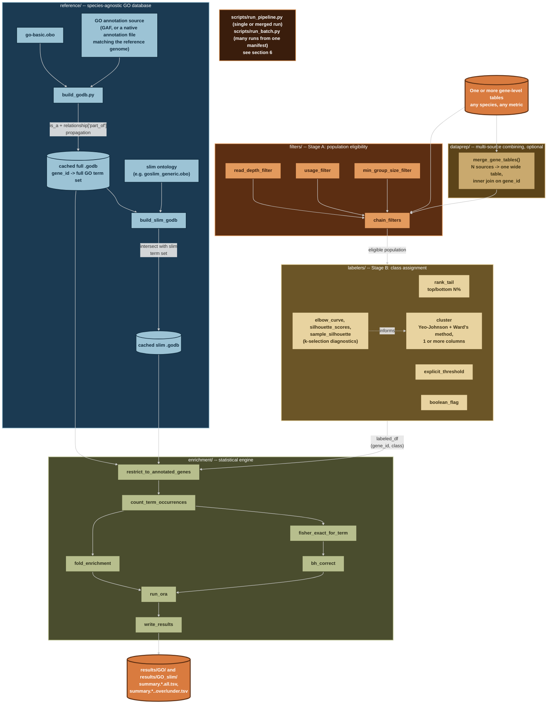

# go-gsea

A generic, species-agnostic GO over-representation analysis (ORA) pipeline.

This tool is not built for one species, one condition, or one research question.
It exposes three independent, composable stages: determine an eligible
population, assign a class label, run the enrichment test. The same tested
engine can serve any labeling question, on any organism with a GO-annotated
reference, without touching the core code. Chlamydomonas is used throughout
this repo as a worked example only (see section 8), the tool itself is meant
to generalize to a different condition on the same species, a different
species entirely, or a different kind of labeling question altogether.

Data and results are deliberately kept out of this repository entirely, see
section 3.

---

## Quick start

Install the environment:

```bash
conda env create -f environment.yml
conda activate go-gsea
```

Run the test suite, to confirm everything imports and works on your machine:

```bash
pytest tests/ -v
```

Minimal single-file example run. This assumes a `.godb` already built from
`reference/build_godb.py` (see section 5) and a gene-level input table
matching section 2's required shape:

```bash
python scripts/run_pipeline.py \
    --input-table path/to/your_gene_table.tsv.gz \
    --godb path/to/your.godb.pkl \
    --metric-col your_metric_column \
    --label-strategy rank_tail --pct 10 \
    --output-dir results/GO \
    --dataset-name your_run_name
```

Multi-source example, for combining several files (e.g. multiple
conditions of the same species) into one wide table before clustering
(see `dataprep/merge_tables.py` and section 6):

```bash
python scripts/run_pipeline.py \
    --merge-manifest merge_manifest.txt \
    --godb path/to/your.godb.pkl \
    --metric-col cond_a cond_b \
    --label-strategy cluster --n-clusters 2 \
    --output-dir results/GO \
    --dataset-name your_merged_run_name
```

Either form writes `summary.<name>.all.tsv` (every GO term tested) and, for
each class with any significant term, `summary.<name>.<class>.over.tsv`
and `.under.tsv` into `results/GO/`. See section 6 for the full flag
reference, and section 8 for seven complete, real, worked demos on real
data.

---

## 1. Why this exists, and its relationship to prior work

This project's statistical core is verified against a real, working precedent:
S. Yamasaki's `create_go_annotation_db.py` / `stats_test_based_on_go.py`
(`sy-scripts`), used in prior lab GO-enrichment work. The Fisher's exact test
construction, the `log2((observed+1)/(expected+1))` fold-enrichment formula,
the Benjamini-Hochberg correction, and the population-definition philosophy
(background = the genes actually analyzable for a given question, never "all
genes in the genome") were all confirmed against that precedent's source code
and real output files before being reimplemented here.

What's different, deliberately:

- **Not tied to one container.** The original tools only run inside a specific
  Singularity image. This pipeline runs in a plain conda environment.
- **Class-label generation is a reusable, tested layer**, not one-off notebook
  code rewritten by hand for every new research question. Every precedent
  notebook inspected during design had its own one-off version of this logic,
  none of it reusable as a library.
- **Every numeric piece has a test**, written against small, hand-checkable
  synthetic data before ever touching real biology. This caught several real
  bugs during development that would otherwise have silently corrupted
  results (see section 7).
- **The GO annotation source is a per-application decision, not a hardcoded
  default.** Which source is correctly ID-matched to a given reference genome
  varies by organism and even by strain/assembly version within the same
  organism, see section 4 and the worked example in section 8.
- **One CLI runs both full-GO and GO-slim in a single call**, writing to
  separate output directories, instead of two duplicated batch files.
- **A generic multi-source merge primitive** (`dataprep/merge_tables.py`)
  combines any number of named columns from any number of files into one
  wide table before labeling, unblocking real multi-condition or
  multi-technology clustering without any species- or condition-specific
  code. See section 8, demos 1 and 2.
- **A plain-text batch driver** (`scripts/run_batch.py`) runs many
  species/condition/metric combinations from one manifest file, chosen
  over CSV specifically for ease of hand-editing (see section 6).
- **Verified on two distinct real metrics, two distinct labeling
  mechanisms, and both single-file and merged-multi-condition scopes**, all
  on the same real dataset, not just one. Seven real demos (section 8), all
  independently converging on the same core biological signal
  (ribosome/translation-machinery genes), across every one of those axes.

---

## 2. Expected input data

`go-gsea` does not read raw sequencing data, alignments, or annotation
output directly. It expects one or more already-prepared, gene-level (or
transcript-level, or any other feature-level) tables as its starting point.
Everything upstream of that table, producing it from raw reads, is a
separate concern.

**Required shape, per input file:**

- Plain or gzipped, tab-separated, one row per gene (or per feature, if
  working at a different level).
- One column of gene IDs, consistent across every file if combining more
  than one (see below). These IDs must be in the same namespace as
  whichever GO annotation source `reference/build_godb.py` is built from
  for that organism (for example, stripped of any version suffix the raw
  gene ID carries, if the annotation source does not carry that suffix).
  ID alignment is checked explicitly, not assumed, before any real run
  (see section 4).
- One or more numeric or categorical columns to be used as the labeling
  metric. Which column(s) are used, and how, is decided entirely by the
  caller through `filters/`, `labelers/`, and, if combining files,
  `dataprep/merge_tables.py`. `go-gsea` itself has no fixed expectation of
  what these columns are named or mean. Derived metrics (a ratio computed
  from two other columns already in the same table) are not statistically
  independent of the columns they were derived from, see the worked
  example in section 8 for a real case of this.

**Combining multiple files** (e.g. several conditions, several technologies,
of the same species): `dataprep/merge_tables.py`'s `merge_gene_tables()`
inner-joins named columns from any number of files on gene ID, keeping only
genes present in every source, matching the real precedent's own stated
rule for multi-dataset clustering ("only genes with data available across
all datasets used in the analysis were selected"). This is the only
mechanism needed to support any number of species x any number of
conditions x single-fraction or paired-fraction data, see section 8 for
worked examples of all of these combinations.

**Where this table typically comes from:** the worked example in this repo
(`docs/examples/chlamydomonas.md`) uses gene-level tables produced by a
Nanopore full-length cDNA long-read RNA-seq processing pipeline
(`Longread_pipeline`, a separate, species-agnostic wet-processing pipeline
that turns raw FASTQ into an annotated per-gene/per-transcript table).
`go-gsea` has no dependency on that pipeline and does not assume long-read
data specifically, any tool that produces a compatible gene-level table
(short-read RNA-seq, microarray, or anything else) is a valid input source.
**If you need the upstream long-read processing pipeline itself, contact
Ibnu Halim directly, it is a separate, not-yet-public repository.**

---

## 3. Repository and data structure

The code repository and the actual data/results are kept in two separate
locations. Code is version-controlled and can be shared publicly. Data and
results are confidential and stay off GitHub entirely.

**Code repository layout:**

```
go-gsea/
├── README.md
├── LICENSE
├── environment.yml
├── pytest.ini
├── reference/          species-agnostic GO database construction,
│                        full-GO and GO-slim builders
├── filters/             Stage A: population-eligibility filters
├── labelers/             Stage B: class-assignment strategies, including
│                          k-selection diagnostics for cluster
├── dataprep/               generic multi-source table merge
├── enrichment/               statistical engine (ORA) plus output writing
├── scripts/                    CLI entry points: run_pipeline.py,
│                                 run_batch.py (section 6)
├── notebooks/                    exploration only, never writes results
├── tests/                          one test file per module
├── docs/
│   └── examples/                        worked examples, chlamydomonas.md
├── data      -> (symlink to a confidential location, see below)
└── results   -> (symlink to the same confidential location, see below)
```

**Confidential data/results location, pointed to by the two symlinks above,
organized per species:**

```
<confidential project folder>/
├── data/
│   ├── raw/
│   │   ├── <SPECIES>_<CONDITION>.gene_data.tsv.gz
│   │   └── ...                       (one file per species+condition)
│   └── go_reference/
│       ├── go-basic.obo                shared, species-agnostic
│       ├── goslim_generic.obo           shared, species-agnostic
│       ├── <SPECIES_1>/
│       │   ├── <SPECIES_1>.annotation_info.txt.gz  (or GAF, whichever
│       │   │                            source was verified right, see
│       │   │                            section 4)
│       │   ├── <SPECIES_1>.godb.pkl
│       │   └── <SPECIES_1>.slim.godb.pkl
│       └── <SPECIES_2>/  ...
└── results/
    ├── GO/                        full-GO enrichment output
    │   ├── summary.<SPECIES>_<CONDITION>.<metric>.all.tsv
    │   └── summary.<SPECIES>_<COND_A>-<COND_B>.<metric>_cluster.all.tsv
    │        (merged multi-condition run naming)
    └── GO_slim/                    same naming, GO-slim output
```

`.gitignore` excludes both symlink targets by name, with no trailing slash.
A symlink pointing at a directory is not itself a directory as far as git's
slash-suffixed ignore patterns are concerned, this was a real early mistake
in this project, worth remembering.

---

## 4. Design principles

These are the parts of the earlier per-species decisions that generalize,
true regardless of which organism, condition, or metric a given run is
about.

- **Population = every gene actually analyzable for that specific question,
  never "all genes in the genome" or a population borrowed from a different
  analysis.** Enforced mechanically:
  `enrichment.ora.restrict_to_annotated_genes()` drops genes with zero GO
  annotation from the population before any counting happens. The
  population-eligibility filters in `filters/population.py` implement the
  same principle one stage earlier, verified on real data. For merged,
  multi-file runs, `dataprep.merge_tables.merge_gene_tables()`'s default
  inner join implements the same principle at the merge stage: a gene not
  present in every source file is not part of the population at all,
  matching the real precedent's own stated rule for multi-dataset
  clustering.
- **Both `is_a` and `part_of` relationships must be propagated for correct
  GO term inheritance.** `goatools`'s own `GODag.get_all_parents()` was
  empirically confirmed to only follow `is_a`, silently omitting `part_of`
  edges even when `optional_attrs=["relationship"]` is loaded.
  `reference/build_godb.py` implements its own `get_all_ancestors()` walker
  combining both, verified against real terms with confirmed `part_of`
  edges.
- **GO-slim is a filter on top of full-GO propagation, not a separate
  propagation pass.** Verified on real data with a direct subset check:
  every gene's slim term set must be a strict subset of that same gene's
  full term set, confirmed with zero violations before this was trusted.
  Verified consistent across every real run in section 8, including
  3-class and multi-condition cases, not just the original 2-class case.
- **Significance threshold: p < 0.01, uncorrected, is the default, not
  BH-corrected q-value.** The precedent lab's own documented reasoning:
  repeated testing across classes compounds the multiple-testing problem
  beyond what standard FDR correction assumes; GO terms have parent-child
  dependencies that violate the independence assumption FDR correction
  relies on; and q-values are unstable across reruns for reasons unrelated
  to the actual data under test, while p-values are not. Confirmed
  concretely on real data: with over a thousand terms tested per class, the
  smallest observed p-values still carry BH-corrected q-values of 1.0 in
  every real run so far, a q<0.01 cutoff would have erased every real
  significant finding these runs correctly surfaced. Language constraint
  that follows from the same reasoning: results at this threshold should be
  described as genes that "tended to include" a GO term, not as
  "statistically significant" findings.
- **A GO-slim run producing zero (or very few) significant terms is not
  automatically a sign of correctness or of a bug**, check the actual
  p-value spread in the "all" output file before concluding either way.
  Confirmed with multiple contrasting real runs, same code, same species,
  same GO-slim mechanism: some real metrics produce zero significant
  GO-slim terms with no real pileup near zero in the p-value distribution
  (a genuine absence of a slim-detectable signal), while other real runs on
  the same genes produce several, with a clear pileup near zero. The same
  mechanism tested repeatedly on real data with different, data-dependent
  outcomes each time is stronger evidence the slim code path is correct
  than any single result alone.
- **`fold_enrichment` direction is computed independently of `scipy`'s
  Fisher's exact `odds_ratio`,** not derived from it, since `odds_ratio`'s
  sign and magnitude depend on which row of the 2x2 table is "row 0," an
  orientation-dependent convention that caused real test failures during
  development.
- **The GO annotation source must be chosen for correct gene-ID alignment
  with the specific reference genome in use, never assumed generically.**
  The obvious choice (a general-purpose GAF, for example from UniProt-GOA)
  is not automatically correct: it may be built against a different strain
  or assembly version than the actual reference genome a project uses,
  causing a large, silent ID mismatch. The correct source is whichever
  file's gene ID namespace was built from the same reference genome release
  the rest of the analysis uses, confirmed by direct ID-overlap testing,
  not assumed. See the worked example in section 8 for how this played out
  for one real case, including a same-species crosswalk file that turned
  out not to bridge two assembly versions once actually checked.
- **An unknown-gene-ratio guard should exist, but its threshold is a
  tunable parameter, not a fixed constant.** `run_ora(...,
  unknown_ratio_thresh=...)` exposes this as an argument for exactly this
  reason, since expected annotation coverage varies enormously by species
  and by annotation source.
- **A derived metric is not an independent second question**, even when it
  produces a genuinely different GO enrichment result. Running the pipeline
  on both a base metric and something derived from it is a useful,
  real check of generalization, not evidence of independent validation on
  two unrelated questions, see the worked example in section 8.
- **Different labeling mechanisms converging on the same biological
  signal is stronger evidence than either mechanism's result alone.** A
  fixed top/bottom percentage split and an unsupervised clustering approach
  are different in kind. When both, independently, surface the same
  enriched GO terms for the same underlying biology, that convergence is
  meaningful evidence the pipeline is finding something real, not an
  artifact of one particular labeling choice. Confirmed repeatedly across
  the worked example's seven real demos (section 8).
- **Real clustering runs should be checked for tied-value artifacts before
  a chosen k is trusted, not just by looking at the elbow/silhouette
  curves in isolation.** A cluster with a suspiciously perfect (or
  near-perfect) mean/min silhouette score is worth checking directly
  against known floor effects in the data (e.g. many genes tied at exactly
  zero after a transform) before concluding real structure was found, this
  caught a real, otherwise-invisible artifact during development (see the
  worked example, section 8). A moderate cluster count with no
  artifact is more trustworthy than a larger one that scores better only
  because it isolates a tied-value block as its own "cluster."
- **Ward's-method clustering, as implemented here, has been verified
  deterministic within a session** (byte-identical output across repeated
  runs on the same real data), but results from before a given session, or
  produced under different library versions, should not be assumed to
  reproduce exactly without re-verifying, see the worked example (section
  8) for a real case where an earlier documented result could not be
  reproduced and was corrected rather than carried forward silently.

---

## 5. Architecture



Every module in this diagram is real, tested code, see section 7 for test
counts, except `reference/build_godb.py` which is verified against real
data instead (also section 7). Nothing in `filters/`, `labelers/`, or
`dataprep/` knows what any specific metric or species means, that
knowledge lives entirely in whatever calls them, currently
`scripts/run_pipeline.py`/`scripts/run_batch.py` (section 6) or a
hand-written script.

---

## 6. CLI reference

### `scripts/run_pipeline.py`

The single entry point tying `reference/`, `dataprep/`, `filters/`,
`labelers/`, and `enrichment/` together for one run. It knows nothing
about any specific species or metric, every organism- or
question-specific detail below is a flag or a manifest file, not a
hardcoded assumption.

**Input source (exactly one required):**

| Flag | Meaning |
|---|---|
| `--input-table` | Path to a single gene-level TSV, plain or `.gz` |
| `--merge-manifest` | Path to a plain-text, INI-style manifest listing multiple source files to merge into one wide table first (see below). Mutually exclusive with `--input-table` |

**Merge manifest format** (used with `--merge-manifest`), one `[section]`
per source, section name becomes the merged table's column name:

```ini
[cond_a]
path = data/raw/species_condA.gene_data.tsv.gz
value_col = PR_gene

[cond_b]
path = data/raw/species_condB.gene_data.tsv.gz
value_col = PR_gene
```

Required keys per section: `path`, `value_col`. With this manifest,
`--metric-col cond_a cond_b` picks up the merged columns directly.

**Reference and ID handling:**

| Flag | Required | Meaning |
|---|---|---|
| `--godb` | yes | Path to a cached full `.godb` from `reference/build_godb.py` |
| `--slim-godb` | no | Path to a cached slim `.godb`. If given, also runs GO-slim enrichment |
| `--id-col` | no, default `gene_id` | Gene ID column name |
| `--strip-id-suffix` | no | Regex stripped from gene IDs before matching against the godb. Applied BEFORE `--exclude-id`; with `--merge-manifest`, applied to the merged result |
| `--exclude-id` | no, repeatable | Gene ID(s) to drop before labeling (e.g. a spike-in control). Applied AFTER `--strip-id-suffix`, give the already-stripped form if both are used |

**Labeling (Stage B, see `labelers/labelers.py`):**

| Flag | Meaning |
|---|---|
| `--metric-col` | Required, one or more values. `rank_tail`/`explicit_threshold`/`boolean_flag` each require exactly one. `cluster` accepts one or more (a single column for 1D clustering, several for a joint/multi-condition clustering) |
| `--label-strategy` | Required. One of `rank_tail`, `explicit_threshold`, `boolean_flag`, `cluster` |
| `--pct` | Used by `rank_tail`. Percent for each tail, default 10 |
| `--high-thresh`, `--low-thresh` | Used by `explicit_threshold` |
| `--n-clusters` | Used by `cluster`. Should be chosen using the diagnostics in `notebooks/select_cluster_k.ipynb`, not guessed, see section 4 |

**Enrichment and output:**

| Flag | Meaning |
|---|---|
| `--output-dir` | Required. Where full-GO results are written |
| `--slim-output-dir` | Required if `--slim-godb` is given |
| `--dataset-name` | Required. Used to name output files |
| `--unknown-ratio-thresh` | Default 0.9 |
| `--thresh-type` | `p` or `q`, default `p` |
| `--thresh` | Default 0.01 |

### `scripts/run_batch.py`

Batch driver for running many `run_pipeline.py` invocations from one
plain-text manifest, chosen over CSV for ease of hand-editing: no column
alignment, no blank cells for fields that don't apply to a given run,
comments supported, each run's settings visually grouped:

```ini
[CR_3D_PR_gene]
species = CR
condition = 3D
input_table = data/raw/CR_3D.gene_data.tsv.gz
godb = data/go_reference/CR/CR.godb.pkl
metric_col = PR_gene
label_strategy = rank_tail
pct = 10
```

Required keys per section: `species`, `condition`, `input_table`, `godb`,
`metric_col`, `label_strategy`. `dataset_name`, if omitted, is
auto-derived as `<species>_<condition>.<metric_col>`. One section failing
(bad file, bad reference) does not stop the rest of the batch. Run with:

```bash
python scripts/run_batch.py manifest.txt
python scripts/run_batch.py manifest.txt --dry-run   # preview without executing
```

Seven complete, real invocations covering both single-file and merged
scopes are shown in `docs/examples/chlamydomonas.md` (section 8), along
with confirmation that each reproduces the exact same numbers as an
independent hand-written or by-hand-verified run.

---

## 7. Testing status

Every numeric module has synthetic-data tests, run via `pytest` (repo root
needs `pythonpath = .` in `pytest.ini` for imports to resolve, already
configured).

| Module | Tests | Notes |
|---|---|---|
| `filters/population.py` | 7 | Includes a composed multi-filter interaction test. Also verified against real data (section 8) |
| `labelers/labelers.py` | 12 | 8 for the four labeling strategies, plus 4 for the k-selection diagnostics (`elbow_curve`, `silhouette_scores`, `sample_silhouette`), all verified on real data too (section 8), including a real correction of an initially wrong k choice |
| `enrichment/ora.py` | 23 | Includes the `restrict_to_annotated_genes` population-correctness fix |
| `enrichment/output.py` | 5 | Covers the all/over/under file split |
| `dataprep/merge_tables.py` | 9 | Covers the inner-join default, an explicit outer-join option, gzip support, and duplicate/missing-column guardrails |
| `scripts/run_pipeline.py` (core) | 6 | Real subprocess-based CLI tests against synthetic data |
| `scripts/run_pipeline.py` (`--metric-col` widening) | 9 | Validates single- vs multi-column strategy requirements at both the function and CLI level |
| `scripts/run_pipeline.py` (`--merge-manifest`) | 5 | Confirms mutual exclusivity with `--input-table`, and that the inner-join default holds through the full CLI path |
| `scripts/run_batch.py` | 11 | Plain-text manifest parsing plus real multi-section batch execution, including the one-bad-section-does-not-stop-the-rest behavior |
| `reference/build_godb.py` | Not unit-tested; verified against real data instead (section 8) | The `is_a`/`part_of` propagation gap and the slim intersection's subset property were both caught via direct interactive verification |

**87 automated tests, all passing.**

---

## 8. Worked examples

Real, end-to-end applications of this pipeline, showing how the general
principles in section 4 play out for a specific organism, dataset, and
research question. These are examples, not specifications, a different
organism, condition, or question may reasonably make different choices at
each decision point, following the same principles.

- **[`docs/examples/chlamydomonas.md`](docs/examples/chlamydomonas.md)**,
  *Chlamydomonas reinhardtii*. Seven real demos across two growth-stage
  conditions (3 and 6 days), three metrics (PR_gene, TPM, PTPM), both
  labeling strategies with real precedent (`rank_tail`, `cluster`), and
  both single-file and genuine merged-multi-condition scopes. Every demo
  independently converges on the same core biological signal
  (ribosome/translation-machinery genes), across every one of those axes,
  the strongest form of evidence this project has produced that the
  pipeline is finding something real.

Additional examples (a different species, a non-expression-based labeling
strategy) belong here as separate files as they are built, each
documenting its own specific choices without altering the general
principles in section 4.

---

## 9. Known limitations and open items

- **Ortholog-transfer GO supplementation is designed, not built.** For
  organisms or genes with sparse direct GO annotation, transferring GO
  terms from a best-hit ortholog in a better-annotated species is a
  documented option in the worked example but not yet implemented as
  reusable code.
- **`gseapy` is an unused dependency.** Installed for a future ranked/GSEA
  mode, no code path uses it yet.
- **No provenance-stamping on output files.** `write_results()` writes
  plain TSVs without the JSON metadata footer the precedent's own output
  carried (script version, package versions, run date).
- **`scripts/check_id_overlap.py` (ID-verification for a new species'
  candidate GO annotation source) is not built.** The check has been done
  by hand, correctly, for Chlamydomonas, but is not yet a reusable script.
- **All seven real demos are gene-level, one species, two conditions.**
  `explicit_threshold` and `boolean_flag` remain unverified outside
  synthetic tests, no real use case for either has presented itself on
  this dataset yet. Transcript- or variant-level data, and a second
  species, are also unexercised.
- **`notebooks/select_cluster_k.ipynb` only reads a single input file.**
  k-selection diagnostics for a merged, multi-condition run currently
  require a short standalone script instead (shown in the worked example),
  not the notebook's normal interactive workflow.
- **Commit history is intentionally terse.** This README (and the worked
  examples it links to), not the commit log, is the authoritative record
  of what changed and why.