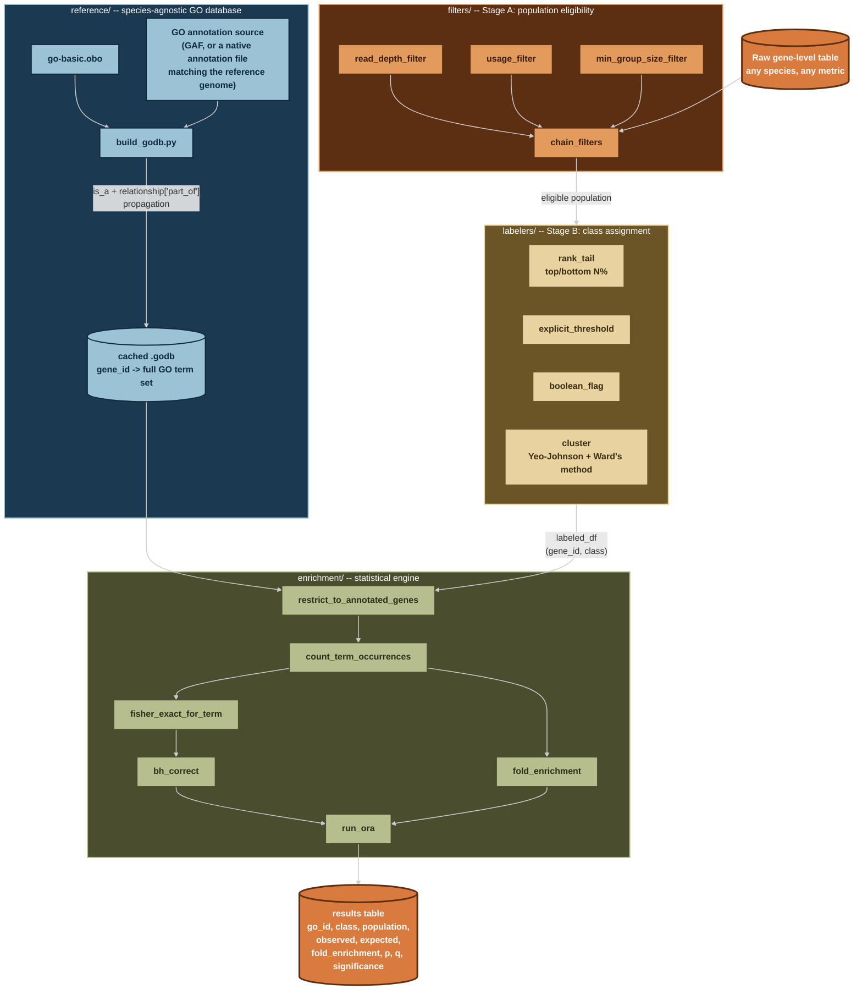

# go-gsea

A generic, species-agnostic GO over-representation analysis (ORA) pipeline.

This tool is not built for one species, one condition, or one research question.
It exposes three independent, composable stages: determine an eligible
population, assign a class label, run the enrichment test. The same tested
engine can serve any labeling question, on any organism with a GO-annotated
reference, without touching the core code. Chlamydomonas is used throughout
this repo as a worked example only (see section 7), the tool itself is meant
to generalize to a different condition on the same species, a different
species entirely, or a different kind of labeling question altogether.

Data and results are deliberately kept out of this repository entirely, see
section 3.

---

## 1. Why this exists, and its relationship to prior work

This project's statistical core is verified against a real, working precedent:
S. Yamasaki's `create_go_annotation_db.py` / `stats_test_based_on_go.py`
(`sy-scripts`), used in prior lab GO-enrichment work. The Fisher's exact test
construction, the `log2((observed+1)/(expected+1))` fold-enrichment formula,
the Benjamini-Hochberg correction, and the population-definition philosophy
(background = the genes actually analyzable for a given question, never "all
genes in the genome") were all confirmed against that precedent's source code
and real output files before being reimplemented here.

What's different, deliberately:

- **Not tied to one container.** The original tools only run inside a specific
  Singularity image. This pipeline runs in a plain conda environment.
- **Class-label generation is a reusable, tested layer**, not one-off notebook
  code rewritten by hand for every new research question. Every precedent
  notebook inspected during design had its own one-off version of this logic
  (a top/bottom-percent-by-rank cell, a clustering cell, a threshold-filter
  cell), none of it reusable as a library, each rewritten from scratch per
  question.
- **Every numeric piece has a test**, written against small, hand-checkable
  synthetic data before ever touching real biology. This caught several real
  bugs during development that would otherwise have silently corrupted
  results (see section 6).
- **The GO annotation source is a per-application decision, not a hardcoded
  default.** Which source is correctly ID-matched to a given reference genome
  varies by organism and even by strain/assembly version within the same
  organism, see section 4 and the worked example in section 7.

---

## 2. Expected input data

`go-gsea` does not read raw sequencing data, alignments, or annotation
output directly. It expects a single, already-prepared, gene-level (or
transcript-level, or any other feature-level) table as its starting point.
Everything upstream of that table, producing it from raw reads, is a
separate concern.

**Required shape:**

- Plain or gzipped, tab-separated, one row per gene (or per feature, if
  working at a different level).
- One column of gene IDs. These IDs must be in the same namespace as
  whichever GO annotation source `reference/build_godb.py` is built from
  for that organism (for example, stripped of any version suffix the raw
  gene ID carries, if the annotation source does not carry that suffix).
  ID alignment is checked explicitly, not assumed, before any real run
  (see section 4).
- One or more numeric or categorical columns to be used as the labeling
  metric (expression, a ratio like translational efficiency, a boolean
  motif flag, or anything else). Which column is used, and how, is decided
  entirely by the caller through `filters/` and `labelers/`, `go-gsea`
  itself has no fixed expectation of what these columns are named or mean.

**Where this table typically comes from:** the worked example in this repo
(`docs/examples/chlamydomonas.md`) uses a gene-level table produced by a
Nanopore full-length cDNA long-read RNA-seq processing pipeline
(`Longread_pipeline`, a separate, species-agnostic wet-processing pipeline
that turns raw FASTQ into an annotated per-gene/per-transcript table).
`go-gsea` has no dependency on that pipeline and does not assume long-read
data specifically, any tool that produces a compatible gene-level table
(short-read RNA-seq, microarray, or anything else) is a valid input source.
**If you need the upstream long-read processing pipeline itself, contact
Ibnu Halim directly, it is a separate, not-yet-public repository.**

---

## 3. Repository and data structure

The code repository and the actual data/results are kept in two separate
locations. Code is version-controlled and can be shared publicly. Data and
results are confidential and stay off GitHub entirely.

**Code repository layout:**

```
go-gsea/
├── README.md
├── environment.yml
├── pytest.ini
├── reference/          species-agnostic GO database construction
├── filters/             Stage A: population-eligibility filters
├── labelers/             Stage B: class-assignment strategies
├── enrichment/             statistical engine (ORA)
├── scripts/                 CLI entry points (not yet built, see section 8)
├── notebooks/                 exploration only, never writes results here
├── tests/                       one test file per module
├── docs/
│   └── examples/                    worked examples, e.g. chlamydomonas.md
├── data      -> (symlink to a confidential location, see below)
└── results   -> (symlink to the same confidential location, see below)
```

**Confidential data/results location, pointed to by the two symlinks above:**

```
<confidential project folder>/
├── data/
│   ├── raw/                     copies of input gene-level tables
│   └── go_reference/             go-basic.obo, GO annotation source, cached .godb
└── results/
    ├── GO/                        full-GO enrichment output
    └── GO_slim/                    GO-slim enrichment output (not yet implemented)
```

`.gitignore` excludes both symlink targets by name, with no trailing slash.
A symlink pointing at a directory is not itself a directory as far as git's
slash-suffixed ignore patterns are concerned, this was a real early mistake
in this project, worth remembering.

---

## 4. Design principles

These are the parts of the earlier per-species decisions that generalize,
true regardless of which organism, condition, or metric a given run is
about.

- **Population = every gene actually analyzable for that specific question,
  never "all genes in the genome" or a population borrowed from a different
  analysis.** A population that has already been filtered by some
  detectability or depth criterion is, by construction, not a random sample
  of the genome, comparing it against a raw genome-wide background creates
  systematic, directional bias in the result, not just extra noise. This is
  enforced mechanically, not just by convention:
  `enrichment.ora.restrict_to_annotated_genes()` drops genes with zero GO
  annotation from the population before any counting happens, matching the
  precedent's own `population_list` construction. Skipping this step was an
  actual bug caught during development (see section 6), it silently
  inflated every population/expected-count denominator with genes that
  could never contribute to any term's count.
- **Both `is_a` and `part_of` relationships must be propagated for correct
  GO term inheritance.** `goatools`'s own `GODag.get_all_parents()` was
  empirically confirmed to only follow `is_a`, silently omitting `part_of`
  edges even when `optional_attrs=["relationship"]` is loaded.
  `reference/build_godb.py` implements its own `get_all_ancestors()` walker
  combining both, verified against real terms with confirmed `part_of`
  edges. This applies to any OBO-format ontology, not a species-specific
  concern.
- **Significance threshold: p < 0.01, uncorrected, is the default, not
  BH-corrected q-value.** Standard multiple-testing practice would suggest
  q-value/FDR correction. The precedent lab's own documented reasoning: GO
  enrichment run repeatedly (once per class, or once per cluster) compounds
  the multiple-testing problem beyond what standard FDR correction assumes;
  GO terms have parent-child dependencies that violate the independence
  assumption FDR correction relies on, so even a "corrected" q-value is not
  fully accurate; and q-values are unstable across reruns for reasons
  unrelated to the actual data under test (they shift with how many other
  GO terms happen to be in the annotation file, or how many classes are
  being compared), while p-values do not have this instability. Both p and
  q are always computed and reported regardless of which is used as the
  cutoff, `thresh_type`/`thresh` are run-time parameters, not hardcoded.
  Language constraint that follows from the same reasoning: results at this
  threshold should be described as genes that "tended to include" a GO
  term, not as "statistically significant" findings, since no
  multiple-testing correction is applied.
- **`fold_enrichment` direction is computed independently of `scipy`'s
  Fisher's exact `odds_ratio`,** not derived from it. `odds_ratio`'s
  sign and magnitude depend on which row of the 2x2 table is "row 0," an
  orientation-dependent convention that caused real test failures during
  development. The precedent's own `log2((observed+1)/(expected+1))`
  formula sidesteps this entirely and is more directly interpretable
  regardless of table construction order.
- **The GO annotation source must be chosen for correct gene-ID alignment
  with the specific reference genome in use, never assumed generically.**
  The obvious choice (a general-purpose GAF, for example from UniProt-GOA)
  is not automatically correct: it may be built against a different strain
  or assembly version than the actual reference genome a project uses,
  causing a large, silent ID mismatch. The correct source is whichever
  file's gene ID namespace was built from the same reference genome release
  the rest of the analysis uses, confirmed by direct ID-overlap testing, not
  assumed. See the worked example in section 7 for how this played out for
  one real case, including a same-species crosswalk file that turned out
  not to bridge two assembly versions once actually checked.
- **An unknown-gene-ratio guard should exist, but its threshold is a
  tunable parameter, not a fixed constant.** How much of a gene list is
  expected to fall outside the chosen GO annotation source's coverage
  varies enormously by species and by annotation source (a sparse,
  high-ID-confidence source versus a broad, lower-confidence one).
  `run_ora(..., unknown_ratio_thresh=...)` exposes this as an argument for
  exactly this reason.

---

## 5. Architecture



Every module in this diagram is real, tested code, see section 6 for test
counts. Nothing in `filters/` or `labelers/` knows what any specific metric
(expression, translation efficiency, a structural feature, anything else)
or species means, that knowledge lives entirely in whatever script or
notebook calls them. A CLI entry point (`scripts/run_pipeline.py`) tying
this together generically is not yet built, see section 8.

---

## 6. Testing status

Every numeric module has synthetic-data tests, run via `pytest` (repo root
needs `pythonpath = .` in `pytest.ini` for imports to resolve, already
configured).

| Module | Tests | Notes |
|---|---|---|
| `filters/population.py` | 7 | Includes a composed multi-filter interaction test |
| `labelers/labelers.py` | 8 | `cluster()`'s Yeo-Johnson step returns a `(array, lambda)` tuple from `scipy`, not just an array, caught here, not in production |
| `enrichment/ora.py` | 23 | Includes the `restrict_to_annotated_genes` population-correctness fix, verified with a dedicated test that a term's `population` count reflects only annotated genes, not the full input |
| `reference/build_godb.py` | Not unit-tested; verified against real data instead (see section 7's linked example) | The `is_a`/`part_of` propagation gap was caught via direct interactive verification against `go-basic.obo`, not a formal test suite |

All 38 automated tests pass as of the last real-data integration run.

---

## 7. Worked examples

Real, end-to-end applications of this pipeline, showing how the general
principles in section 4 play out for a specific organism, dataset, and
research question. These are examples, not specifications, a different
organism, condition, or question may reasonably make different choices at
each decision point (annotation source, filter thresholds, labeling
strategy), following the same principles.

- **[`docs/examples/chlamydomonas.md`](docs/examples/chlamydomonas.md)**,
  *Chlamydomonas reinhardtii* polysome-ratio (PR) translational-efficiency
  analysis. First real end-to-end run of this pipeline: annotation-source
  selection under a strain/assembly mismatch, real coverage/ID-overlap
  numbers, and the first biologically-interpreted real result.

Additional examples (a different condition on the same species, a different
species entirely, a non-expression-based labeling strategy) belong here as
separate files as they are built, each documenting its own specific
choices without altering the general principles in section 4.

---

## 8. Known limitations and open items

- **No CLI entry point yet.** Every real run so far has been an ad hoc
  interactive script, not `scripts/run_pipeline.py`. Reproducing a run
  currently requires hand-writing Python against the library functions
  directly.
- **GO-slim is not implemented.** Prior precedent work ran full-GO and
  GO-slim as a parallel pair for every dataset, this pipeline currently
  only supports full-GO.
- **Ortholog-transfer GO supplementation is designed, not built.** For
  organisms or genes with sparse direct GO annotation, transferring GO
  terms from a best-hit ortholog in a better-annotated species (using a
  donor `.godb`) is a documented option in the worked example but not yet
  implemented as reusable code, and would need its own provenance tagging
  so transferred annotations are never conflated with direct ones.
- **`gseapy` is an unused dependency.** Installed for a future ranked/GSEA
  mode (useful for continuous metrics, avoiding an arbitrary top/bottom
  cutoff entirely), but no code path uses it yet.
- **No output-writing or provenance-stamping.** The precedent's output
  files carry a JSON metadata footer (script version, package versions,
  run date), useful for reproducibility, not yet replicated here. Results
  currently only exist as an in-memory DataFrame from whatever script
  produced them.
- **Commit history is intentionally terse.** This README (and the worked
  examples it links to), not the commit log, is the authoritative record
  of what changed and why.
